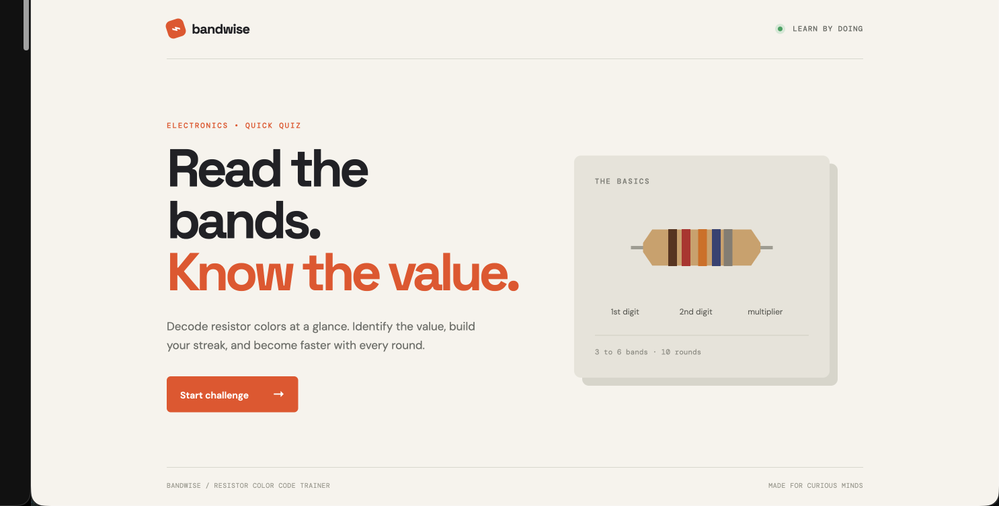

# Learn Resistor Code



A quick browser quiz for learning to read resistor color codes. Learn Resistor Code shows a randomly generated resistor with 3 to 6 color bands and asks you to identify its resistance value, tracking your score and streak across 10 rounds.

## Play

Learn Resistor Code is a static site with no build step or dependencies — just open `index.html` in a browser, or serve the folder locally:

```bash
python3 -m http.server 8000
```

Then visit `http://localhost:8000`.

## How it works

- Each round generates a resistor with 3–6 bands: 2–3 significant digits, a multiplier, and (for 4+ bands) a tolerance band, plus a temperature coefficient band for 6-band resistors.
- You enter the resistance value and pick a unit (Ω, mΩ, kΩ, MΩ), then check your answer against the generated value.
- Correct answers build your streak; the round ends after 10 questions with a summary of score, accuracy, best streak, and total bands read.

## Project structure

- `index.html` — page structure and screens (start, game, results)
- `app.js` — quiz logic: resistor generation, rendering, answer checking, scoring
- `styles.css` — visual styling
